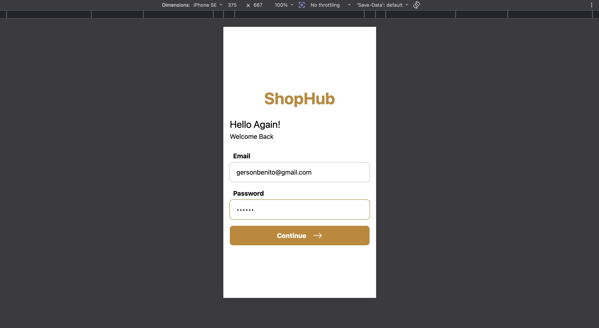

# signal-form

Lightweight Angular starter project with small form components and auth features.

## Overview

`signal-form` is an Angular app demonstrating small reusable form components (`input`, `checkbox`, `button`) and a minimal auth feature set (login, register). It includes server and client entry points so it can be run in typical development setups and supports testing for components.

## What's Included

- **Core components:** `input`, `checkbox`, `button` (under `src/app/components`).
- **Features:** `auth` (login, register) and `not-found` route.
- **Core utilities:** app configuration, routes, and small helper functions (under `src/app/core`).
- **Server entry points:** `main.server.ts`, `server.ts` for server-side bootstrapping.
- **Environments:** development and production environment files (`src/environments`).

## Screenshot




## Project Structure (top-level)

- `src/` — application source
  - `app/` — app modules, components, features
  - `main.ts` — client bootstrap
  - `main.server.ts` — server bootstrap
- `public/` — static assets
- `angular.json`, `package.json`, `tsconfig.json` — build and tooling

## Scripts

- `npm start` — start the development server (see `package.json` scripts).
- `npm test` — run tests.

Run locally:

```bash
npm install
npm start
```

Run tests:

```bash
npm test
```

## Contributing

Contributions welcome. Open an issue or submit a pull request with a clear description and tests if applicable.

## License

Specify a license in `package.json` or add a `LICENSE` file.
# SignalForm

This project was generated using [Angular CLI](https://github.com/angular/angular-cli) version 22.0.8.

## Development server

To start a local development server, run:

```bash
ng serve
```

Once the server is running, open your browser and navigate to `http://localhost:4200/`. The application will automatically reload whenever you modify any of the source files.

## Code scaffolding

Angular CLI includes powerful code scaffolding tools. To generate a new component, run:

```bash
ng generate component component-name
```

For a complete list of available schematics (such as `components`, `directives`, or `pipes`), run:

```bash
ng generate --help
```

## Building

To build the project run:

```bash
ng build
```

This will compile your project and store the build artifacts in the `dist/` directory. By default, the production build optimizes your application for performance and speed.

## Running unit tests

To execute unit tests with the [Vitest](https://vitest.dev/) test runner, use the following command:

```bash
ng test
```

## Running end-to-end tests

For end-to-end (e2e) testing, run:

```bash
ng e2e
```

Angular CLI does not come with an end-to-end testing framework by default. You can choose one that suits your needs.

## Additional Resources

For more information on using the Angular CLI, including detailed command references, visit the [Angular CLI Overview and Command Reference](https://angular.dev/tools/cli) page.
